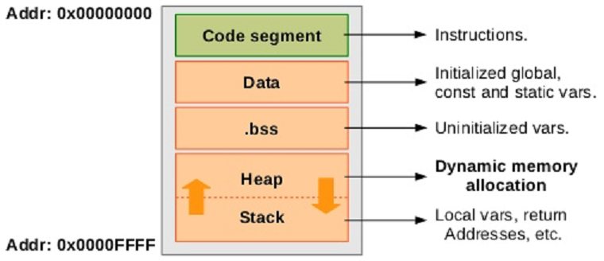

# Size



+ text (Code segment ~ Text segment)
+ data (Data segment)
+ .bss (BSS segment ~ uninitialized data segment)


## CMD

```sh
    $(size_compile) $(build_path)/$(target).elf
```

## OUTPUT

+ Don't create the parameter

```sh
C:\\avr-gcc-12.1.0-x64-windows\\bin\\avr-size Build/led.elf
   text    data     bss     dec     hex filename
   3158       0       0    3158     c56 Build/led.elf
```

+ Create some parameter

```sh

#include "use.h"
uint8_t i = 1;
uint8_t k = 0;
uint8_t j;
extern void setup(void){
}
extern void loop(void){
}
```

```sh
C:\\avr-gcc-12.1.0-x64-windows\\bin\\avr-size Build/led.elf
   text    data     bss     dec     hex filename
   3196       2       2    3200     c80 Build/led.elf
```

***uint8_t i = 1;*** -------1 byte------- data

***uint8_t k = 0;*** -------1 byte------- .bss

***uint8_t j;*** -------1 byte------- .bss